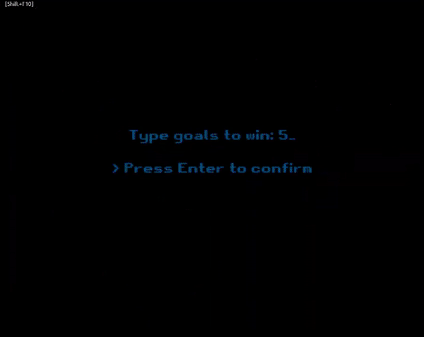

# 
CIU - Práctica 1

## Contenidos

* [Autoría](#autoría)
* [Introducción](#introducción)
* [Controles](#controles)
* [Implementación base](#implementación-base)
    * [Definición de la estructura](#definición-de-la-estructura)
    * [Rebote de la pelota](#rebote-de-la-pelota)
      * [Rebote con los muros superior/inferior](#rebote-con-los-muros-superiorinferior)
      * [Rebote con los jugadores](#rebote-con-los-jugadores)
    * [Marcador de puntos](#marcador-de-puntos)
    * [Efectos sonoros](#efectos-sonoros)
    * [Movimiento inicial aleatorio](#movimiento-inicial-aleatorio)
* [Implementaciones adicionales](#implementaciones-adicionales)
    * [Pantalla inicial de selección](#pantalla-inicial-de-selección)
    * [Pantalla de Game Over](#pantalla-de-game-over)
    * [Pulsado de una tecla para lanzar la pelota](#pulsado-de-una-tecla-para-lanzar-la-pelota)
    * [Uso de una fuente externa](#uso-de-una-fuente-externa)
    * [Objetos de bonificación](#objetos-de-bonificación)
* [Animación del juego](#animación-del-juego)
* [Referencias](#referencias)
    * [Material](#material)
    * [Herramientas](#herramientas)
    * [Guías y ayuda](#guías-y-ayuda)

## Autoría

Esta obra es un trabajo realizado por Benearo Semidan Páez para la asignatura de Creación de Interfaces de Usuario cursada en la ULPGC.

## Introducción

El objetivo de esta práctica consiste en implementar en Processing el clásico juego del Pong.

De manera base, consiste en 2 jugadores en forma de palo que pueden moverse únicamente en el eje Y. El objetivo es hacer pasar la pelota detrás del muro del adversario para anotar puntos.

A continuación, veremos los detalles de implementación. En primer lugar, identificaremos los aspectos básicos del juego y luego, mostraremos las características adicionales añadidas.

## Controles

Jugador 1
- Arriba: [ W ]
- Abajo: [ S ]

Jugador 2
- Arriba: [ Flecha arriba ]
- Abajo: [ Flecha abajo ]

## Implementación base

En la implementación base se nos solicitaba:

- Rebote de la pelota
- Marcador de puntos
- Incluir efectos sonoros
- Movimiento inicial de la pelota aleatorio

### Definición de la estructura

Para facilitarla lectura del código, trataremos de disgregar y explicar los distintos fragmentos del código.

El programa usa de manera aproximada la arquitectura <b>MVC</b>. Para ello, usamos 3 pestañas en el editor de Processing, que corresponde a tres ficheros <i>.pde</i>.

En 'modelo' tenemos las definiciones de objetos del juego, como son la pelota, el jugador, la posición o la velocidad, entre otros.

En 'controller' disponemos de la mayor parte del código. Dispone de las clase <i>GameManager</i>, la cual se encarga de realizar interacciones entre objetos, como identifica colisiones pelota-jugador o pelota-muro, a modo de ejemplo.

El último fichero, 'pong' contiene las llamadas al <i>GameManager</i> necesarias para realizar la impresión en pantalla de los elementos, por lo que podríamos considerarlo la vista.

 

Con esta breve explicación de la estructura usada, proseguimos a mostrar la manera de resolver los objetivos propuestos.

### Rebote de la pelota

El movimiento de la pelota se realiza sumando a la posición actual de esta la velocidad en los ejes respectivos.

      // Método move() de la pelota

      currentPosition.x += currentSpeed.x;
      currentPosition.y += currentSpeed.y;

Por lo tanto, el cálculo del rebote implica el cálculo de la velocidad a aplicar en cada eje.

#### Rebote con los muros superior/inferior

Este es el más simple y se logra cambiando el signo de la velocidad en el eje Y.

    // Método collisionBallToWall() de GameManager

    if(ball.currentPosition.y > height - (ball.dimension.width/2) || ball.currentPosition.y < 0 + (ball.dimension.width/2)) {    
        ball.currentSpeed.y *= -1;
        thread("CollisionSound");
    }

#### Rebote con los jugadores

Este requiere más trabajo con fin de evitar errores visuales inesperados, así como un rebote más natural con respecto a la zona de choque de la pelota.

El cálculo de la velocidad lo extraje de [esta web](https://thecodingtrain.com/CodingChallenges/067-pong.html) y del vídeo presente en la misma.

La idea principal es mapear todo el alto del jugador para que el choque de la bola en una altura específica implique un radián determiando y así, mediante el seno para X y el coseno para Y, obetener la velocidad adecuada para el ángulo de incidencia de la pelota respecto al jugador.

    // Jugador de la izquierda

    float diff = ballY - (leftPlayerY - leftPlayerHeight/2);
    float radians =  radians(45);
    float angle = map(diff, 0, leftPlayerHeight, -radians, radians);
    ball.currentSpeed.x = 2 * ball.MOVEMENT * cos(angle);
    ball.currentSpeed.y = 2 * ball.MOVEMENT * sin(angle);
    ball.currentPosition.x = leftPlayerX + (leftPlayerWidth/2) + ballRadius;
    thread("CollisionSound");

    // Jugador de la derecha

    float diff = ballY - (rightPlayerY - rightPlayerHeight/2);
    float angle = map(diff, 0, rightPlayerHeight, radians(225), radians(135));
    ball.currentSpeed.x = 2 * ball.MOVEMENT * cos(angle);
    ball.currentSpeed.y = 2 * ball.MOVEMENT * sin(angle);
    ball.currentPosition.x = rightPlayerX - (rightPlayerWidth/2) - ballRadius;
    thread("CollisionSound");

### Marcador de puntos

La puntuación de los jugadores está implementada dentro de <i>GameManager</i>, ya que es el que detecta cuando la bola traspasa la "portería" de un jugador.

Existe una variable para el jugador izquierda y una para el de la derecha, a las que se van sumando los puntos. Más adelante se hablara de esta puntuación, ya que de manera adicional incluí un <i>Game Over</i>.

### Efectos sonoros

Para implementar audio en el juego hago uso de la librería SoundFile {enlace a librería} sugerida en clase. Para evitar conflictos, todos los audios se emiten desde un hilo meadiante el método de Processing thread(), a excepción del usado en el mencionado <i>Game Over</i> por motivos que describiremos posteriormente.

### Movimiento inicial aleatorio

El movimiento aleatorio se implementa dentro del constructor de la clase <i>Ball</i>.

Para ello, elegimos aleatoriamente un número entre -pi/4 y pi/4, y calculamos la velocidad de igual manera a como lo hicimos con el rebote con los jugadores.

En la firgura de abajo se muestra la parte del código oportuna.

    // Parte del constructor de Ball

    int signX = -1 + (int)random(2) * 2;
    int signY = -1 + (int)random(2) * 2;
    float angle = random(-PI/4, PI/4);
    float xspeed = 2 * MOVEMENT * cos(angle);
    float yspeed = 2 * MOVEMENT * sin(angle);
    currentSpeed = new Speed(signX*xspeed, signY*yspeed);

Cabe destacar que la pelota es la que implementa su movimiento inicial y no el <i>GameManager</i> debido que, al puntuar un jugador, creamos una nueva instancia de la pelota para garantizar que está limpia de el contenido adicional implementado en ella.

 

Y con esto, finaliza la implmentación base del Pong.

## Implementaciones adicionales

En las características adicionales se incluye:

- Pantalla inicial de selección de máxima puntuación
- Objetos de bonificación
- Pantalla de Game Over y reinicio de la partida
- Pulsado de una tecla para lanzar la pelota
- Uso de fuente de texto externa

### Pantalla inicial de selección

En esta pantalla, se solicita el número de goles necesarios para ganar, para lo cual podemos usar las teclas numéricas superiores, el retroceso para eliminar y la tecla </i>Enter</i> para aceptar. Por defecto, este valor está definido a 5 goles. Permite hasta un máximo de 9999. Si el usuario lo deja a 0, se deja en el valor por defecto.

Para desplegar esta pantalla en el momento adecuado, disponemos de la variable <i>isInGame</i> en el GameManager.

### Pantalla de Game Over

Esta pantalla es bastante simple, consistiendo de un texto mostrando quién ganó la partida y, cuando acaba el sonido propio de esta pantalla, volvemos a la pantalla inicial de selección. Es por ello que la música reproducida aquí no puede ser reproducida en un hilo, ya que se requiere de poder llamar al método <i>isPlaying()</i> de SoundFile desde fuera del hilo.

### Pulsado de una tecla para lanzar la pelota

Mientras la partida no haya acabado, o bien esté empezando, cada vez que se vaya a lanzar la pelota se solicitará pulsar la tecla 'R'.

Con esto evitamos que se descontrole los lanzamientos del mismo al irse marcando goles sucesivos.

### Uso de una fuente externa

Para el texto usado en el juego, he descargado una fuente en .tff. Esta requiere de una conversión a .vlw, la cual se realiza mediante las herramientas del IDE de Processing.

Además, es necesario que permanezca en el directorio 'data/' debido a cuestiones de Processing.

### Objetos de bonificación

Como último y más complejo añadido, usé el concepto de juegos similares de la época de Pong que introduce unas cajas de bonificación que, al pasar la bola sobre ellas, activan algún efecto determinado.

Para ello, usamos una interfaz y una clase abstracta, que nos permite escribir distintas clases de efectos que dispongan de los métodos <i>triggerEffect()</i> y <i>revertEffect()</i>, así como los distintos atributos de uso común, como son <i>Position</i> o <i>color</i>.

    interface EffectTriggerer {
        public void triggerEffect();
        public void revertEffect();
    }

    abstract class EffectBox implements EffectTriggerer {
        Position currentPosition;
        Dimension dimension;
        color fillColor;
        PImage icon;
        int effectiveTime = 0;
        boolean triggered = false;

        public EffectBox(Position aparitionPosition, Dimension size, color fill, PImage iconImage) {
            currentPosition = aparitionPosition;
            dimension = size;
            fillColor = fill;
            icon = iconImage;
        }

        public void display() {
             if(triggered) {
                 if(millis() > effectiveTime + EFFECT_DISPELL_SECONDS*1000) {
                     revertEffect();
                     manager.effects.remove(this);
                 }
             } else {
                 noFill();
                 stroke(fillColor);
                 rectMode(CENTER);
                 rect(currentPosition.x, currentPosition.y, dimension.width, dimension.height);
                 imageMode(CENTER);
                 image(icon, currentPosition.x, currentPosition.y, dimension.width - 10, dimension.height - 10);
             }
        }

    }

Para esta clase abstracta, creé 4 extensiones:

- SmallBallEffectBox
- BigBallEffectBox
- SlowBallEffectBox
- FastBallEffectBox

Estas cajas de efectos o bonificadores aparecen cada EFFECT_SECONDS en el escenario y no tienen ninguna duración de desaparición. Quepa destacarse que no se cuenta el tiempo en el que el juego espera a que el jugador lance la pelota o en estados fuera de una partida, como en la selección o cuando alguien gana.

Estos elementos aparecen en posiciones aleatorios y se retiran del mapa únicamente cuando se activan su efecto. El efecto dura EFFECT_DISPELL_SECONDS, tras lo que deshace el efecto que realizó.

Para permitir la elección aleatoria tanto de efectos a aparecer como su posición, fue necesario hacer uso del patrón generativo <i>Factory method</i>.

Para ello, definimos una interfaz la cual implementaremos en tantas clases como clases de EffectBox existente (4 en este caso).

    interface EffectBoxFactory {
        public EffectBox create();
    }

Estas clases implementarán el método <i>create()</i>, que devuelve una nueva instancia de EffectBox, apropiada a la clase solicitada.

    class SmallBallFactory implements EffectBoxFactory {

        public EffectBox create() {
            return new SmallBallEffectBox(new Position(random(200, width-200), random(200, height-200)), new Dimension(60, 60), color(0, 0, 255));
        }

    }

    class BigBallFactory implements EffectBoxFactory {

        public EffectBox create() {
            return new BigBallEffectBox(new Position(random(200, width-200), random(200, height-200)), new Dimension(60, 60), color(255, 150,0));
        }

    }

    class SlowBallFactory implements EffectBoxFactory {

        public EffectBox create() {
            return new SlowBallEffectBox(new Position(random(200, width-200), random(200, height-200)), new Dimension(60, 60), color(255,0, 0));
        }

    }

    class FastBallFactory implements EffectBoxFactory {

        public EffectBox create() {
            return new FastBallEffectBox(new Position(random(200, width-200), random(200, height-200)), new Dimension(60, 60), color(0,255,0));
        }

    }

Y con esto, finalizan los apartados adicionales implementados.

## Animación del juego
;

## Referencias

### Material

<quote>Todo el material usado está licensiado con Creative Commons 0.</quote>

<b>[[Sonidos y música]](https://freesound.org/)</b>

<b>[[Fuente de texto]](https://www.dafont.com/es/bitmap.php)</b>

### Herramientas

<b>[[Diseño de los efectos]](https://www.pixilart.com/draw)</b>

### Guías y ayuda

<b>[[Colisión pelota-jugador]](https://thecodingtrain.com/CodingChallenges/067-pong.html)</b>

<b>[[Referencia de Processing]](https://processing.org/reference/)</b>
